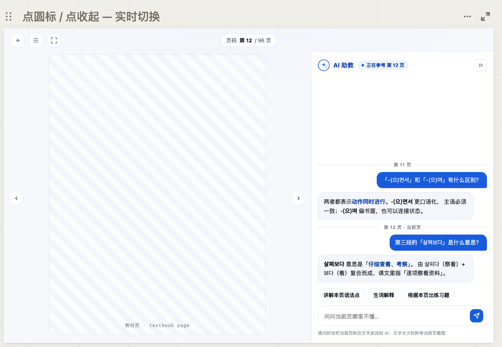
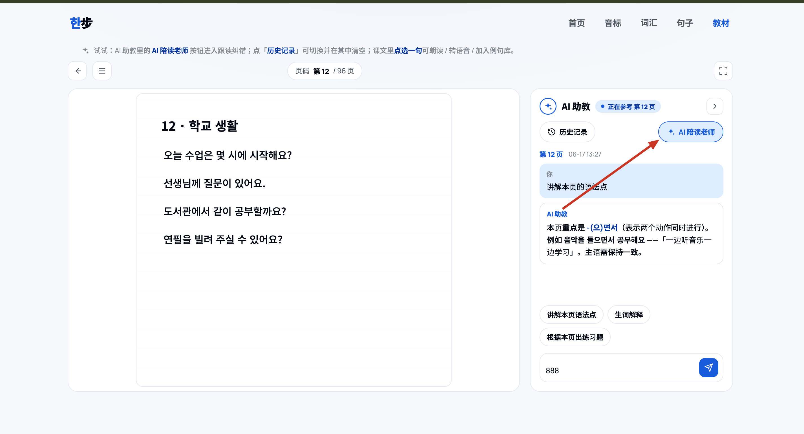
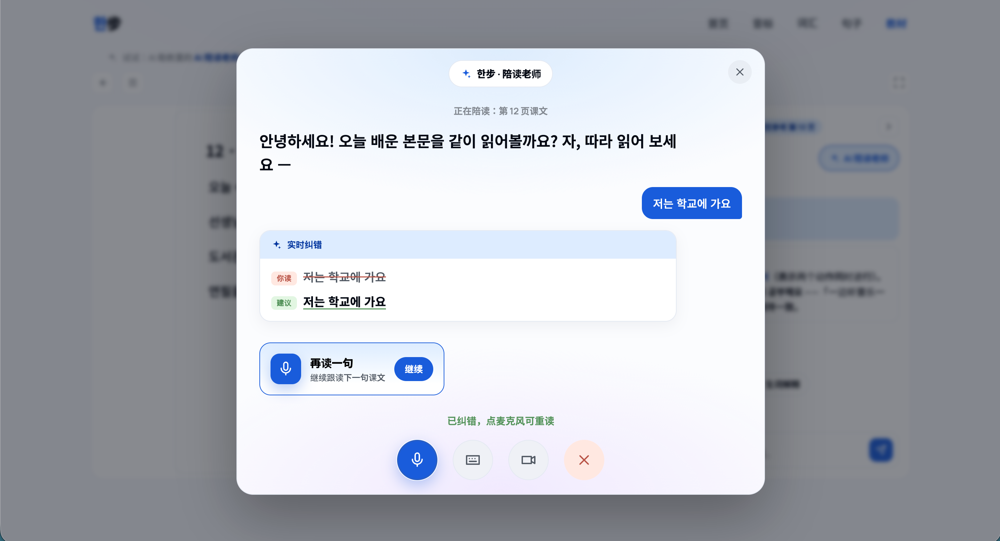
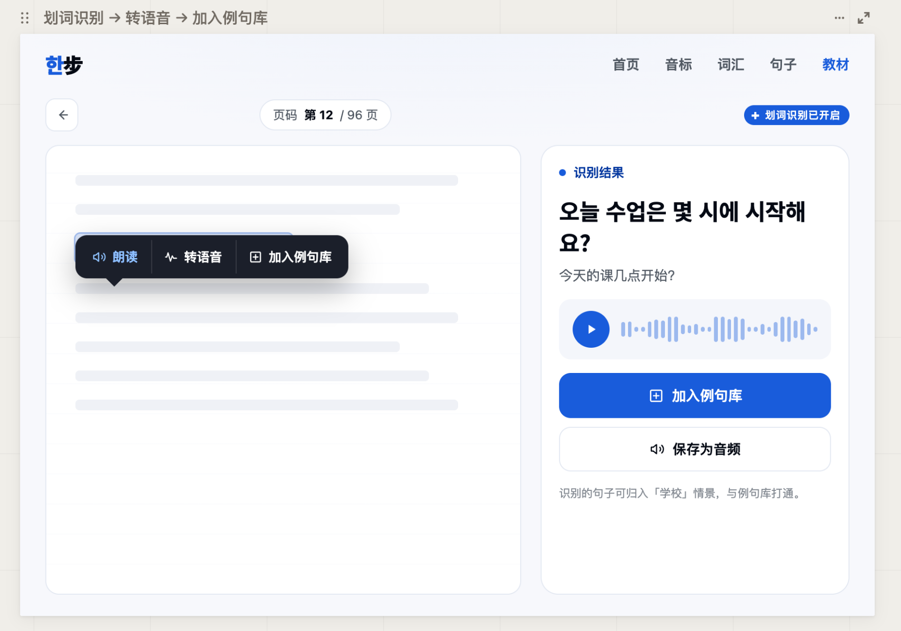

# Korean Learn 产品愿景与创新点

更新日期：2026-06-23

## 1. 产品愿景

Korean Learn 的长期方向是成为一个跨 Web、iPhone、iPad 的全球化韩语学习工作台。当前中文版本用于验证产品方向、学习流程和内容结构；当中文版本的核心学习闭环稳定后，产品将扩展为多语言版本，服务不同母语国家的韩语学习者。

它不追求一次性塞入很多学习资料，而是帮助用户围绕“当前正在学的一小块内容”完成听、读、问、记、复习。

一句话愿景：

让全球韩语初学者在一个安静、清晰、可持续的学习空间里，用自己熟悉的母语理解韩语，并把教材内容真正练成自己的能力。

## 2. 核心判断

这个产品最重要的判断是：

资料展示不是学习，合理训练才是学习。

所以产品不应该只把四十音、词汇、句子、教材堆出来，而应该围绕每个内容单元提供明确训练动作：

- 听一遍。
- 跟读一遍。
- 看懂规则。
- 对比容易混淆的内容。
- 收进复习。
- 回到教材上下文。

## 3. 三端定位

### Web

Web 是当前主产品和内容工作台。

适合承担：

- 音标、词汇、例句、教材的主学习入口。
- 管理后台。
- 教材 PDF 上传和 AI 问答。
- 快速迭代新功能。
- 调试数据和内容结构。

### iPhone

iPhone 更适合碎片化复习。

适合承担：

- 每日短练。
- 四十音快速听读。
- 词汇卡片复习。
- 句子跟读。
- 教材学习进度查看。
- 收藏、生词、提醒。

### iPad

iPad 更适合沉浸式教材学习。

适合承担：

- 左侧教材 PDF，右侧音频、词汇、笔记。
- Apple Pencil 批注。
- 划线和备注。
- 点击句子播放音频。
- 课文逐句跟读。
- 听力材料分段播放。
- 教材页 AI 问答。
- 大屏四十音发音表。

## 4. 创新点

### 4.1 教材页 增强AI场景
#### 4.1.1 问本页

核心功能：

- 用户可以基于教材内容当前页直接提问。AI 基于当前页文字、截图对内容进行直接回复，帮助用户解答教材词汇、语法、语音音变规则，帮助用户基于本课教材提供专项训练内容，帮助用户进行课外主题扩展。

价值：

- 降低用户查语法、查词、理解听力原文的成本。
- 避免 AI 脱离教材乱讲。
- 让 PDF 从静态阅读材料变成可互动学习材料。

当前状态：

- Web 已有 PDF AI 助教基础能力。
- 当前默认支持 Gemini/OpenAI。
- Gemini 视觉能力适合处理截图页。

设计稿地址：korean_learn/design/05-AI助教重设计-对比.html

#### 4.1.2  AI语音对话训练入口  

核心功能：

- 用户可以通过AI语音对话直接进行听力和口语的练习，练习内容可以直接基于教材进行主题训练，也可以自定义主题进行对话训练。AI语音音色提供多种不同音色，辅助进行真实的听力训练。

价值：

- 在教材词汇和语法学习后，可以直接进行语音对话训练
- 补齐语言学习的听说能力，让教材内容从原本的读写到现在的听说读写，全面增强
- **提供多种场景、多种音色。多种场景提供基于课程主题进行听说训练，提供课堂外的自定义主题进行听说训练，提供多种不同的音色，帮助用户进行真实的语音训练，避免出现相同的语句、不同的音色和语速就无法分辨**

当前状态：

- 当前业务逻辑未实现，已出UI UX 设计稿

设计稿地址：design/Innovation_point_design/6-交互原型v6.html

#### 4.1.3  教材文本转语音 （教材内的句子添加导入到例句库，包含生成的语音文件）

核心功能：

- 支持用户上传的教材文本内容通过划词选中后，转换成相应的语音文件，支持用户收听音频文件，进行跟读训练
- 文本转语音后，支持用户把文本以及语音添加到例句库中进行保存，构建自己的私人语句库进行学习
- 将教材和例句进行结合，数据之间同步，不孤立数据

价值：

- 教材文本内容直接转语音，补齐教材在听、说训练上的短板。

当前状态：

- 当前业务逻辑未实现，已出UI UX 设计稿

UI设计稿地址：design/Innovation_point_design/1-初版设计稿.html

### 4.2 音标训练结构化

四十音不是平铺 40 个字符，而是按照学习认知结构组织：

- 松音、紧音、送气音。
- 单元音、双元音。
- 基础收音。
- 双收音规则。

每个音标详情应包含：

- 发音技巧。
- 位置变化。
- 示例词。
- 对比词。
- 不存在某类对比时的明确说明。

价值：

- 音标不再是孤例数据，而是结合相应的词汇进行练习，提升训练效率，让音标训练不再那么枯燥，能直接开口说
- 提供音标在不同词位的示范，能让用户直接理解音标在不同位置的实际发音规则
- 提供对比词汇，让辅音的学习更加清晰

当前状态：

- Web 已形成结构化数据和详情展示。
- 移动端正在追求与 Web 内容一致。

UI设计稿：design/Implemented_design/03-音标-方案A.html

### 4.3 音标、词汇关联记忆

核心功能：

- 词汇与音频
- 文本转语音后，支持用户把文本以及语音添加到例句库中进行保存，构建自己的私人语句库进行学习
- 将教材和例句进行结合，数据之间同步，不孤立数据

价值：

- 教材文本内容直接转语音，补齐教材在听、说训练上的短板。

当前状态：

- 当前业务逻辑未实现，已出UI UX 设计稿

UI设计稿地址：design/Innovation_point_design/1-初版设计稿.html

### 4.4 教材、音频、词汇、笔记联动

长期理想状态：

1. 单词卡片上的“音标交互化” (Interactive IPA)
音标不应只是静态文本，而应成为发音导引工具：

点击音标发音：在单词卡片中，点击音标的特定符号（或整个音标串）。
视觉强化：如果用户在“音标全览”中某些音标处于“褪色（需复习）”状态，当这些音标出现在当前单词中时，可以进行视觉高亮（如颜色微调或下划线），提醒用户注意这个特定发音。

2. “发音锚点”纠错机制 (Pronunciation Anchors)
当用户在单词录音练习中得分较低时，系统应自动进行归因分析：

精准反馈：系统不只是说“单词读错了”，而是指出“这个单词里的 /θ/ 音发得不准”，并弹出一个微型音标提示卡，链接回音标学习页面的教学。
肌肉记忆联动：让用户先单独练习这个音标 2 次，再重新尝试读这个单词，形成“音素 -> 单词”的即时校准。

3. “以词带音”的复习逻辑 (Contextual Review)
将音标的“褪色”复习融入到单词学习流中：

智能选词：当系统检测到你的某个音标需要复习时，在今天的词汇计划中优先加入含有该音标的单词。

隐形复习：用户在学单词的同时，默默完成了音标的“重新点亮”，而不需要专门回到音标列表页。

价值：

- 通过词汇和音标的关联，动态进行发音纠正，增强训练。

当前状态：

- UI设计稿和功能实现均未完成

### 4.5 本地优先的用户教材

当前 Web 的教材策略是用户本地上传 PDF，浏览器本地解析和缓存，不上传整本书。

价值：

- 避免服务器存储大文件。
- 降低版权和隐私风险。
- MVP 阶段部署简单。

限制：

- 换设备无法自动同步。
- 浏览器存储和性能会成为限制。
- 未来如果做多端，需要设计用户教材云同步或私有对象存储方案。

### 4.6 跨端同一套学习数据

产品长期不应该让 Web、App、iPad 各做一套孤立内容。三端应该共享：

- 账号。
- 教材库。
- 学习进度。
- 词汇状态。
- 收藏。
- 笔记。
- 批注。
- AI 历史。

价值：

- 用户在 Web 上传教材，iPad 可以继续学习。
- iPhone 可以复习 Web 或 iPad 中收藏的词。

当前状态：

- 移动端可以读取 Web API。
- 个人数据同步还没有实现。

### 4.7 全球多语言学习与国际化

核心功能：

- 产品面向全球不同母语用户学习韩语。
- 当前中文版本作为第一阶段测试版本，用于验证音标、词汇、例句、教材、AI 助教和语音训练闭环。
- 中文版本稳定后，逐步推出英文、日文、越南语、泰语、西班牙语等多语言版本。
- 用户可选择界面语言、学习解释语言和翻译语言。
- AI 助教应能按用户母语解释教材内容、词汇、语法和音变规则。
- 音标发音说明应根据不同母语用户的常见发音难点进行本地化提示。

价值：

- 让 Korean Learn 不只是中文用户学习韩语的工具，而是可扩展为全球化韩语学习产品。
- 同一套韩语学习内容可以服务不同语言背景用户，提升内容复用价值。
- 对非中文用户来说，教材页 AI、词汇释义、例句翻译和发音提示都能用自己熟悉的母语理解。
- 后续 AI 语音对话训练可以根据用户母语背景调整提示方式，帮助用户更有效地纠正发音。

当前状态：

- 当前 Web 和文档主要以中文用户为第一批目标用户。
- 多语言 UI、内容翻译、用户语言偏好和本地化解释尚未实现。
- 多语言能力应在中文版本核心学习闭环验证完成后推进。

## 5. 产品原则

1. 训练优先，资料其次。
2. 少做计划，多给路径和方法。
3. 默认保持简单，点击后再展示深度内容。
4. 同一份数据，多端共享。
5. 独有能力只放在最适合的端上。
6. AI 只辅助理解，不替代教材和用户判断。
7. 学习内容必须可校对、可追溯、可持续维护。
8. 当前中文版本是全球化产品的第一阶段验证，不是最终边界。
9. 多语言不是简单翻译菜单，而是让解释、词义、AI 回答和训练反馈适配不同母语用户。

## 6. 不做什么

不把产品做成：

- 课程售卖平台。
- 大而全题库。
- 社区信息流。
- 强制学习计划工具。
- 只会展示资料的电子书架。
- 完全依赖 AI 生成内容的学习产品。
- 只服务单一语言用户、无法扩展到国际化场景的封闭工具。
